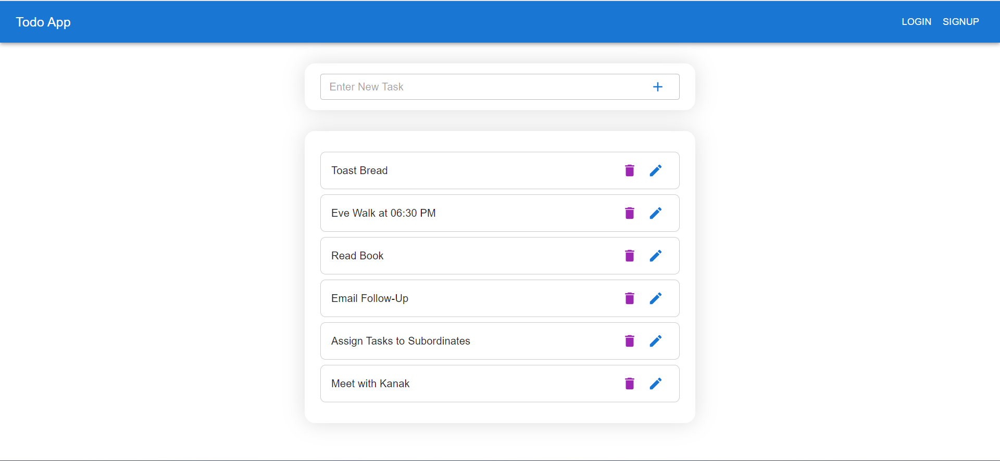

# Todo App

This is a simple todo-app built on top of React.js, Material UI. Node.js, Express.js and MongoDB is used in the backend.


## Screenshots

Below are screenshots showcasing the different pages and functionalities of the Library Management System:

1. All Todos:
    

2. User Signup page:
   

3. User Login page:
   

4. Update Todo:
   

## Installation

To set up the Todo App locally, follow these steps:

```

1. Clone the repository:
    git clone https://github.com/HS831/frappe-lms.git
    cd todo-app

2. Install dependencies for both the frontend and backend:
    cd todo-front
    npm install

    cd todo-back
    npm install

4. Start the backend server on localhost:3001
    cd todo-back
    npm start

5. Start the fronten application on localhost:300
    cd todo-front
    npm start

```

## License

This project is licensed under the [MIT License](LICENSE).

---
